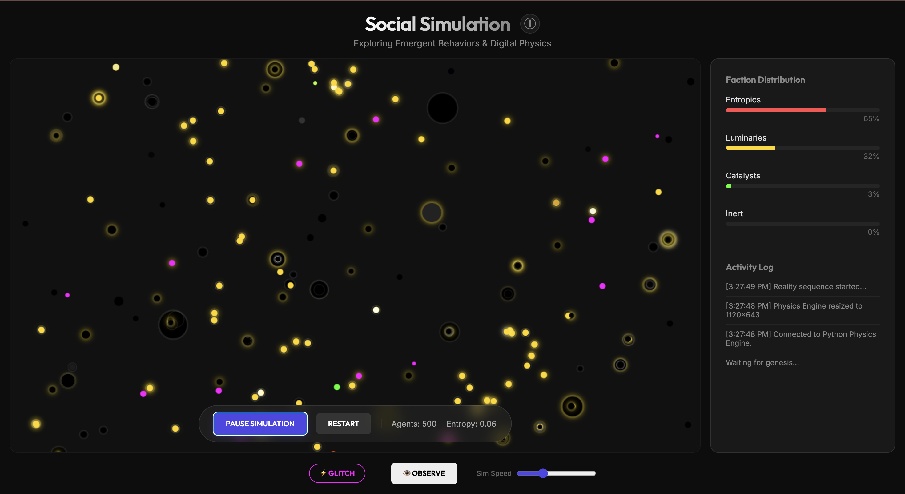

# Social Simulation: Digital Physics

> "Complexity arises from simplicity."

A web-based **Agent-Based Model (ABM)** that simulates the emergence of social structures, factions, and "heat death" in a closed system. It features a **Hybrid Architecture** where a Python backend (Mesa) handles the physics and agent logic, while a JavaScript frontend provides high-performance visualization.



## 🌟 Features

### Core Simulation
- **500 Autonomous Agents**: Each with energy, resources, and one of 40 unique personality types (e.g., "Reaper", "Monk", "Glitch", "Citizen").
- **4 Distinct Factions**:
    - **🌑 Entropics (Predators)**: Seek to consume and convert others. Logic: *Zero-Sum*.
    - **☀️ Luminaries (Protectors)**: Form clusters to heal and share resources. Logic: *Positive-Sum*.
    - **🧪 Catalysts (Chaotic)**: Trigger random state changes and disrupt stagnation. Logic: *Mutation*.
- **Visual Indicators**:
    - **Outer Glowing Halo**: Represents the agent's **Resource Radius**. It grows as they eat or gain energy (`radius = 3 + resource * 4`).
    - **Inner Circle**: The agent's **physical body**. When the radius gets huge, the transparency effects overlap, creating a deep "black hole" look in the center.

### World Phases (Semaphore)
The dashboard displays the current state of the simulation:
- **🌱 GENESIS**: Starts here (first few seconds).
- **⚖️ STABLE**: Normal operation with balanced factions.
- **🔥 CHAOS**: If entropy or aggression spikes (high chaos).
- **👑 DOMINION**: If one faction takes over >50% of the population.
- **💀 COLLAPSE**: If population drops critically (<100 agents).

### Hybrid Architecture
- **Python Backend**: Uses the **Mesa** library for robust agent-based modeling and **FastAPI** to state synchronization.
- **JavaScript Frontend**: Renders the simulation on an HTML5 Canvas at 60FPS.
- **Synchronized State**: The frontend locks its update loop to the backend's step time to prevent drift or flooding.
- **Local Fallback**: If the backend disconnects, the frontend seamlessly switches to a local JavaScript physics engine.

### Digital Physics Powers
- **⚡ Glitch (Deja Vu)**: Triggers a system-wide race condition, teleporting 20% of agents to random coordinates. Useful for breaking up clusters.
- **👁️ Observer (Quantum Collapse)**: Simulates the "Observer Effect" by collapsing the momentum of all agents, freezing them in place until physics takes over again.

## 🧬 Personality Engine

The core diversity of the simulation is driven by the **`personalities.json`** configuration file. It defines:

*   **40 Unique Types**: Mapped across 4 factions.
*   **Attributes**: 
    *   `aggression`: Likelihood to hunt.
    *   `empathy`: Likelihood to share resources.
    *   `metabolism`: Energy consumption rate.
    *   `influence`: Ability to convert others.

👉 **[View Full Configuration (personalities.json)](personalities.json)**

## 🛠️ Technology Stack

- **Backend**: Python 3.9+, Mesa (ABM), FastAPI (API), Uvicorn (Server).
- **Frontend**: Vanilla JavaScript (ES6+), HTML5 Canvas, CSS3 (Glassmorphism).
- **Protocol**: HTTP/1.1 REST API (JSON state transfer).

## 🚀 Getting Started

### Prerequisites
- Python 3.x
- pip

### Installation

1. **Clone the repository** (if applicable) or navigate to the project folder.

2. **Install Backend Dependencies**:
   ```bash
   cd backend
   pip install -r requirements.txt
   ```
   *(Ensure `mesa`, `fastapi`, `uvicorn`, `python-multipart` are installed)*

### Running the Simulation

1. **Start the Python Backend**:
   The backend serves both the API and the static frontend files (to avoid CORS issues).
   ```bash
   cd backend
   python3 main.py
   ```
   *The server will start on `http://0.0.0.0:8021`.*

2. **Access the Simulation**:
   Open your web browser and go to:
   👉 **[http://localhost:8021/static/index.html](http://localhost:8021/static/index.html)**

### Controls

- **START / PAUSE**: Toggle the simulation running state.
- **RESTART**: Reset the world with a new random seed.
- **⚡ GLITCH**: Trigger random teleportation.
- **👁️ OBSERVE**: Trigger momentum freeze.
- **INFO (ⓘ)**: View detailed lore and theory behind the simulation.

## 📂 Project Structure

```
simulation/
├── index.html          # Main entry point (UI)
├── style.css           # Glassmorphism styling
├── simulation.js       # Frontend logic & visualization
├── personalities.json  # Data definitions for 40 agent types
└── backend/
    ├── main.py         # FastAPI server & endpoints
    ├── model.py        # Mesa SocialModel & SocialAgent logic
    └── requirements.txt # Python dependencies
```

## 🧠 The Core Theory

This project explores **Digital Physics**—the idea that the universe can be described as information processing. By defining simple rules for individual agents (move, eat, share, flee), complex "macroscopic" behaviors emerge that resemble real-world social dynamics: segregation, war, cooperation, and economic collapse.

---
*Created for the Advanced Agentic Coding project.*
